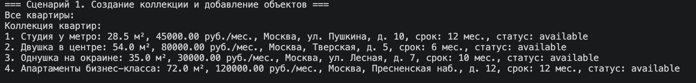
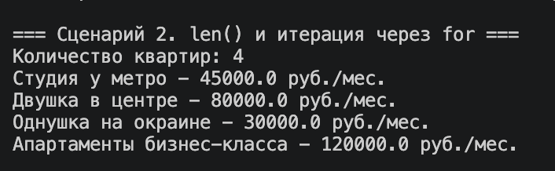
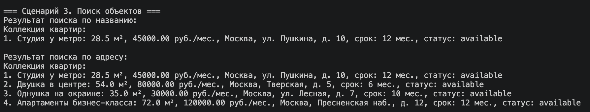
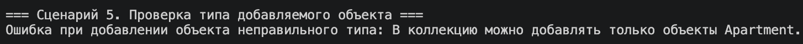
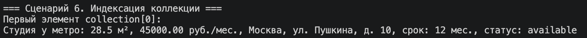
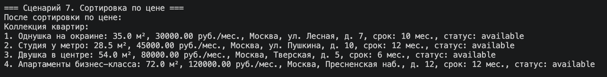
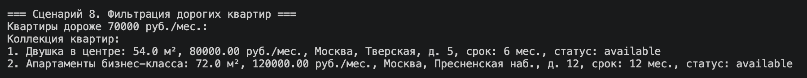

# ЛР-2. Коллекция объектов

## Предметная область
Недвижимость.

## Используемый класс
Используется класс `Apartment` из ЛР-1.

---

## Коллекция

```python
class ApartmentCollection:
    ...
```

`ApartmentCollection` — контейнер для хранения объектов `Apartment`.

---

## Назначение

Класс позволяет:

- добавлять и удалять квартиры  
- хранить список объектов  
- выполнять поиск, сортировку и фильтрацию  
- итерироваться по коллекции  

---

## Хранение данных

```python
self._items = []
```

---

## Основные методы

- `add(item)` — добавление  
- `remove(item)` — удаление  
- `remove_at(index)` — удаление по индексу  
- `get_all()` — получить список  

---

## Поиск

- `find_by_title()`  
- `find_by_address()`  

---

## Сортировка

- `sort_by_price()`  
- `sort_by_area()`  

---

## Фильтрация

- `get_available()`  
- `get_expensive(min_price)`  
- `get_large(min_area)`  

---

## Магические методы

- `__len__`  
- `__iter__`  
- `__getitem__`  
- `__str__`  

---

## Сценарии работы

### Сценарий 1 — создание и добавление объектов



---

### Сценарий 2 — вывод и итерация



---

### Сценарий 3 — поиск



---

### Сценарий 4 — проверка ограничений


---

### Сценарий 5 — индексация



---

### Сценарий 6 — сортировка



---

### Сценарий 7 — фильтрация



---

### Сценарий 8 — удаление



---

## Итог

Реализован класс `ApartmentCollection`, который:

- хранит объекты `Apartment`  
- управляет ими  
- поддерживает поиск, сортировку и фильтрацию  
- позволяет работать с коллекцией как со списком  