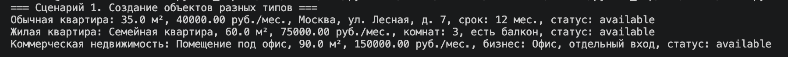
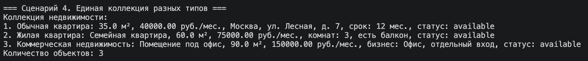
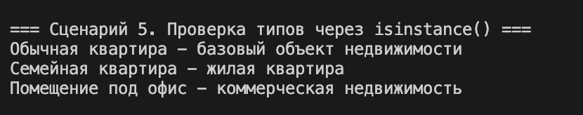
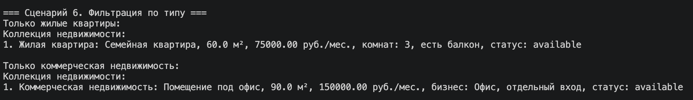
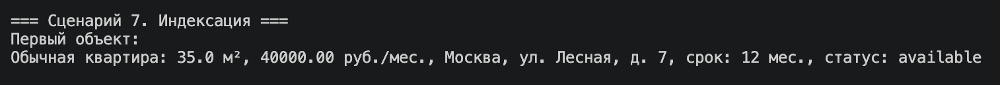

# ЛР-3. Наследование и иерархия классов

## Предметная область

Недвижимость.

## Иерархия классов

```text
Apartment
├── ResidentialApartment
└── CommercialApartment
```

`Apartment` — базовый класс.  
`ResidentialApartment` и `CommercialApartment` — производные классы.

---

## Базовый класс

### `Apartment`

Класс описывает общий объект недвижимости.

Содержит:

- название
- площадь
- цену
- адрес
- срок аренды
- статус

Также содержит общие методы:

- `total_rent_cost()`
- `calculate_income()`
- `display()`
- `rent()`

---

## Дочерний класс `ResidentialApartment`

Описывает жилую квартиру.

Добавлены атрибуты:

- `rooms_count` — количество комнат
- `has_balcony` — наличие балкона

Добавлен метод:

- `is_family_friendly()` — проверяет, подходит ли квартира для семьи

Переопределены методы:

- `calculate_income()`
- `__str__()`

---

## Дочерний класс `CommercialApartment`

Описывает коммерческую недвижимость.

Добавлены атрибуты:

- `business_type` — тип бизнеса
- `has_separate_entrance` — наличие отдельного входа

Добавлен метод:

- `is_suitable_for_business()` — проверяет, подходит ли объект для бизнеса

Переопределены методы:

- `calculate_income()`
- `__str__()`

---

## Использование `super()`

В дочерних классах используется `super()`:

```python
super().__init__(title, area, price, address, rent_months, status)
```

Это позволяет вызвать конструктор базового класса и не дублировать общий код.

---

## Полиморфизм

Метод `calculate_income()` есть у всех классов, но работает по-разному:

- в `Apartment` возвращает обычную стоимость аренды
- в `ResidentialApartment` учитывает бонус за балкон
- в `CommercialApartment` учитывает бонус за отдельный вход

Пример:

```python
for obj in objects:
    print(obj.calculate_income())
```

Один метод вызывается одинаково, но результат зависит от типа объекта.

---

## Коллекция

В `demo.py` реализована коллекция `RealEstateCollection`.

Она может хранить:

- `Apartment`
- `ResidentialApartment`
- `CommercialApartment`

Проверка выполняется через:

```python
isinstance(item, Apartment)
```

---

## Фильтрация по типу

Коллекция поддерживает выборку объектов определённого типа:

```python
only_residential = collection.get_by_type(ResidentialApartment)
only_commercial = collection.get_by_type(CommercialApartment)
```

---

## Сценарии работы

### Сценарий 1 — создание объектов разных типов



---

### Сценарий 2 — методы базового и дочерних классов


---

### Сценарий 3 — полиморфизм


---

### Сценарий 4 — единая коллекция



---

### Сценарий 5 — проверка типов



---

### Сценарий 6 — фильтрация по типу



---

### Сценарий 7 — индексация



---

### Сценарий 8 — ошибка типа


---

## Итог

В лабораторной работе реализованы:

- базовый класс
- два дочерних класса
- наследование
- использование `super()`
- переопределение методов
- полиморфизм
- проверка типов через `isinstance()`
- коллекция объектов разных типов
- фильтрация по типу