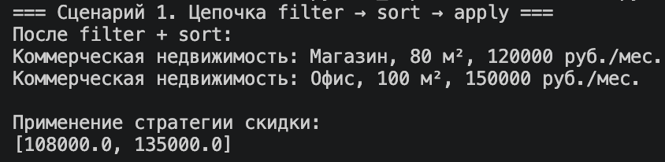
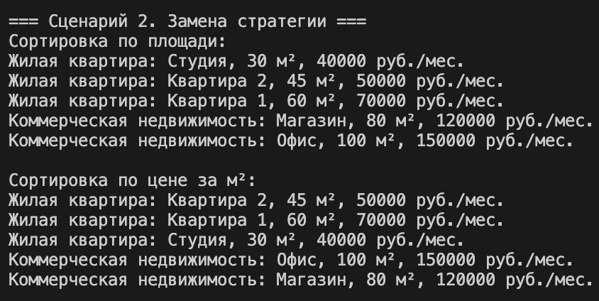
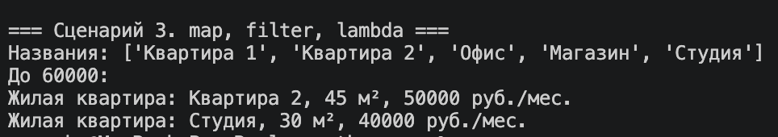

# ЛР-5. Функции как аргументы. Стратегии и делегаты

## Цель работы

Изучить:

- передачу функций как аргументов
- lambda-выражения
- map, filter, sorted
- стратегии сортировки и фильтрации
- callable-объекты
- паттерн «Стратегия»

---

## Реализованные стратегии

### Стратегии сортировки

- `by_price()` — сортировка по цене
- `by_area()` — сортировка по площади
- `by_price_per_m2()` — сортировка по цене за м²

---

## Функции-фильтры

- `is_expensive()` — дорогие объекты
- `is_large()` — большие объекты
- `is_residential()` — только жилые квартиры

---

## Фабрика функций

Реализована функция:

```python
make_price_filter(max_price)
```

Она создаёт и возвращает новый фильтр с заданным ограничением цены.

---

## map(), filter(), sorted()

Использованы встроенные функции:

### map()

```python
map(lambda x: x.title, collection)
```

Преобразование объектов в список названий.

---

### filter()

```python
filter(is_expensive, collection)
```

Фильтрация объектов по условию.

---

### sorted()

```python
sorted(collection, key=by_price)
```

Сортировка коллекции по стратегии.

---

## Методы коллекции

Реализованы методы:

- `sort_by(key_func)`
- `filter_by(predicate)`
- `apply(func)`

---

## Callable-объекты

Реализован callable-объект:

```python
class DiscountStrategy:
```

Объект можно вызывать как функцию.

Пример:

```python
discount(obj)
```

---

## Полиморфизм стратегий

Коллекция не зависит от конкретной стратегии.

Можно передавать разные функции:

```python
collection.sort_by(by_price)
collection.sort_by(by_area)
```

Код коллекции не изменяется.

---

## Сценарии работы

### Сценарий 1 — filter → sort → apply





---

### Сценарий 2 — замена стратегии сортировки





---

### Сценарий 3 — map(), lambda и фабрика функций





---

## Итог

В лабораторной работе реализованы:

- функции как аргументы
- lambda-выражения
- map, filter, sorted
- стратегии сортировки и фильтрации
- фабрика функций
- callable-объекты
- паттерн «Стратегия»
- цепочка операций над коллекцией