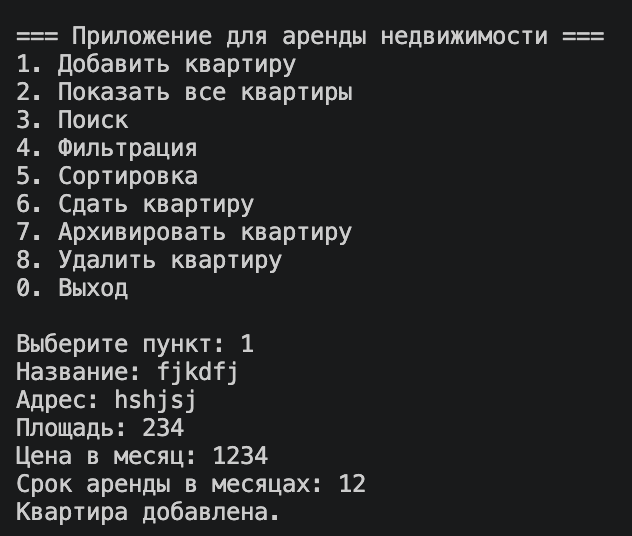
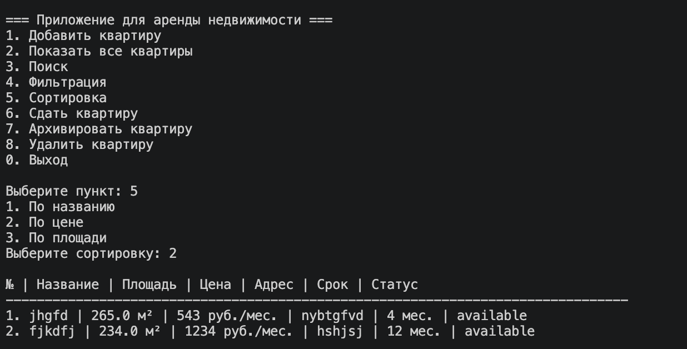
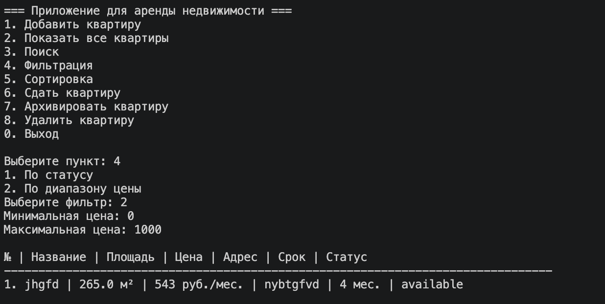

# ЛР-7 — Консольное приложение

## Цель работы

Объединить знания из ЛР-1—ЛР-6 в одно работающее консольное приложение.

В работе реализовано приложение для управления объявлениями аренды недвижимости.

---

## Структура проекта

```text
src/lab07/
├─ README.md
├─ main.py
├─ cli.py
├─ app.py
├─ models.py
├─ exceptions.py
└─ storage.py
```

---

## Назначение файлов

- `main.py` — точка входа в приложение.
- `cli.py` — консольное меню и ввод/вывод.
- `app.py` — бизнес-логика приложения.
- `models.py` — классы предметной области.
- `exceptions.py` — собственные исключения.
- `storage.py` — сохранение и загрузка данных из файла.

---

## Описание приложения

Приложение работает с объявлениями аренды квартир.

Реализованы возможности:

- добавление квартиры
- вывод всех квартир
- поиск по названию и адресу
- фильтрация по статусу и цене
- сортировка по названию, цене и площади
- сдача квартиры в аренду
- архивирование квартиры
- удаление квартиры с подтверждением
- сохранение и загрузка данных из JSON-файла

---

## CLI-меню

При запуске приложения появляется меню:

```text
1. Добавить квартиру
2. Показать все квартиры
3. Поиск
4. Фильтрация
5. Сортировка
6. Сдать квартиру
7. Архивировать квартиру
8. Удалить квартиру
0. Выход
```

Приложение работает в цикле: после выполнения действия меню показывается снова.

---

## Обработка ошибок

В программе реализована обработка некорректного ввода.

Например:

- ввод строки вместо числа
- выбор несуществующего пункта меню
- некорректная цена
- попытка удалить несуществующую квартиру

Также реализованы собственные исключения:

- `DuplicateApartmentError`
- `ApartmentNotFoundError`

---

## Сохранение данных

Данные сохраняются в файл:

```text
apartments.json
```

При запуске приложение автоматически загружает данные из файла.

При выходе через пункт `0` данные сохраняются.

---

## Демонстрация работы

### Сценарий 1 — Вывод коллекции

Показан вывод списка квартир.



---

### Сценарий 2 — Изменение данных

Показано добавление квартиры.


---

### Сценарий 3 — Сортировка

Показана сортировка квартир с выбором стратегии.



---

### Сценарий 4 — фильтрация

Показана фильтрация квартир



---

## Asciinema

Запись работы CLI-приложения:

[](https://asciinema.org/a/0kfI8yXrcCnSUuOl)

---

## Вывод

В лабораторной работе было реализовано консольное приложение с интерактивным меню.

Были применены:

- классы и инкапсуляция
- коллекции объектов
- сортировка и фильтрация
- обработка исключений
- разделение кода на модули
- сохранение и загрузка данных
- аннотации типов
- CLI-интерфейс


[Asciinema demo](https://asciinema.org/a/0kfI8yXrcCnSUuOl)
